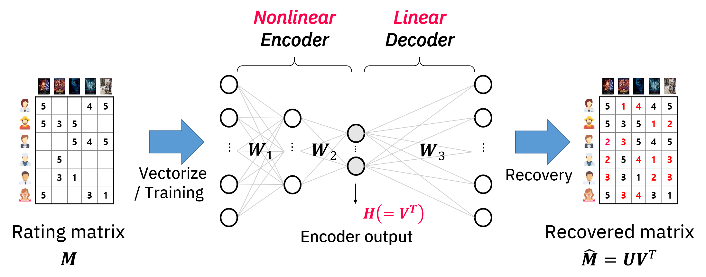
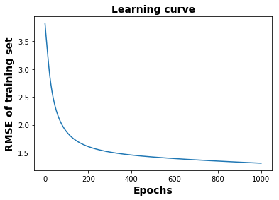

# Recommendation systems with Deep neural network

### **2019/07/01 SK하이닉스-KAIST 기계학습 교육**

***Tip> shotcuts for Jupyter Notebook***
* Shift + Enter : run cell and select below

#### Objective> Train deep neural network (autoencoder) to complete movie rating matrix


<center>Fig. 1 Item-based autoencoder </center>

- #### Loss function

$$L(M, \hat{M})=\sum_{(i,j)\in E}(M_{ij}-\hat{M}_{ij})^2 + \lambda\sum_{i=1}^{3}\lVert W_i\rVert^2_2$$
<br/>
- #### Update weight and bias
$$\underset{W, b}{\text{argmin}}\hspace{0.2em} L(M, \hat{M})$$


```python
import numpy as np
import tensorflow as tf
import pandas as pd
import matplotlib.pyplot as plt
%matplotlib inline

import time
```

<div style="page-break-after: always;"></div>

## 1. Prepare data

### MovieLens Dataset (<a href=https://grouplens.org/datasets/movielens/>ref.</a>)
We use "MovieLens Latest Datasets" consisting of 100,000 ratings applied to 9,000 movies by 600 users. Last updated 9/2018.

### Fetch MovieLens data


```python
rating = pd.read_csv('./data/ratings.csv')
rating.head(5)
```


<table border="1" class="dataframe">
  <thead>
    <tr style="text-align: right;">
      <th></th>
      <th>userId</th>
      <th>movieId</th>
      <th>rating</th>
      <th>timestamp</th>
    </tr>
  </thead>
  <tbody>
    <tr>
      <th>0</th>
      <td>1</td>
      <td>1</td>
      <td>4.0</td>
      <td>964982703</td>
    </tr>
    <tr>
      <th>1</th>
      <td>1</td>
      <td>3</td>
      <td>4.0</td>
      <td>964981247</td>
    </tr>
    <tr>
      <th>2</th>
      <td>1</td>
      <td>6</td>
      <td>4.0</td>
      <td>964982224</td>
    </tr>
    <tr>
      <th>3</th>
      <td>1</td>
      <td>47</td>
      <td>5.0</td>
      <td>964983815</td>
    </tr>
    <tr>
      <th>4</th>
      <td>1</td>
      <td>50</td>
      <td>5.0</td>
      <td>964982931</td>
    </tr>
    <tr>
      <th>5</th>
      <td>1</td>
      <td>70</td>
      <td>3.0</td>
      <td>964982400</td>
    </tr>
    <tr>
      <th>6</th>
      <td>1</td>
      <td>101</td>
      <td>5.0</td>
      <td>964980868</td>
    </tr>
    <tr>
      <th>7</th>
      <td>1</td>
      <td>110</td>
      <td>4.0</td>
      <td>964982176</td>
    </tr>
    <tr>
      <th>8</th>
      <td>1</td>
      <td>151</td>
      <td>5.0</td>
      <td>964984041</td>
    </tr>
    <tr>
      <th>9</th>
      <td>1</td>
      <td>157</td>
      <td>5.0</td>
      <td>964984100</td>
    </tr>
  </tbody>
</table>

<div style="page-break-after: always;"></div>

### Ratings statistics
Count the number of movies with identical rating.


```python
rating.set_index(["userId", "timestamp","rating"]).count(level="rating").rename({'movieId': 'The number of movies'}, axis='columns')
```


<table border="1" class="dataframe">
  <thead>
    <tr style="text-align: right;">
      <th></th>
      <th>The number of movies</th>
    </tr>
    <tr>
      <th>rating</th>
      <th></th>
    </tr>
  </thead>
  <tbody>
    <tr>
      <th>0.5</th>
      <td>1370</td>
    </tr>
    <tr>
      <th>1.0</th>
      <td>2811</td>
    </tr>
    <tr>
      <th>1.5</th>
      <td>1791</td>
    </tr>
    <tr>
      <th>2.0</th>
      <td>7551</td>
    </tr>
    <tr>
      <th>2.5</th>
      <td>5550</td>
    </tr>
    <tr>
      <th>3.0</th>
      <td>20047</td>
    </tr>
    <tr>
      <th>3.5</th>
      <td>13136</td>
    </tr>
    <tr>
      <th>4.0</th>
      <td>26818</td>
    </tr>
    <tr>
      <th>4.5</th>
      <td>8551</td>
    </tr>
    <tr>
      <th>5.0</th>
      <td>13211</td>
    </tr>
  </tbody>
</table>


Count the number of users and movies and check the sparsity


```python
n_user = len(rating['userId'].unique())
n_movie = len(rating['movieId'].unique())
n_rating = len(rating['rating'])
print("[*] %d users & %d movies" % (n_user, n_movie))
print("[*] Sparsity: %.2f%%" % (n_rating / (n_user * n_movie) * 100))
```

    [*] 610 users & 9724 movies
    [*] Sparsity: 1.70%

<div style="page-break-after: always;"></div>

### Movie list

See the movie list including movies' title and genres.


```python
movielist = pd.read_csv('./data/movies.csv')
movielist.head(10)
```


<table border="1" class="dataframe">
  <thead>
    <tr style="text-align: right;">
      <th></th>
      <th>movieId</th>
      <th>title</th>
      <th>genres</th>
    </tr>
  </thead>
  <tbody>
    <tr>
      <th>0</th>
      <td>1</td>
      <td>Toy Story (1995)</td>
      <td>Adventure|Animation|Children|Comedy|Fantasy</td>
    </tr>
    <tr>
      <th>1</th>
      <td>2</td>
      <td>Jumanji (1995)</td>
      <td>Adventure|Children|Fantasy</td>
    </tr>
    <tr>
      <th>2</th>
      <td>3</td>
      <td>Grumpier Old Men (1995)</td>
      <td>Comedy|Romance</td>
    </tr>
    <tr>
      <th>3</th>
      <td>4</td>
      <td>Waiting to Exhale (1995)</td>
      <td>Comedy|Drama|Romance</td>
    </tr>
    <tr>
      <th>4</th>
      <td>5</td>
      <td>Father of the Bride Part II (1995)</td>
      <td>Comedy</td>
    </tr>
    <tr>
      <th>5</th>
      <td>6</td>
      <td>Heat (1995)</td>
      <td>Action|Crime|Thriller</td>
    </tr>
    <tr>
      <th>6</th>
      <td>7</td>
      <td>Sabrina (1995)</td>
      <td>Comedy|Romance</td>
    </tr>
    <tr>
      <th>7</th>
      <td>8</td>
      <td>Tom and Huck (1995)</td>
      <td>Adventure|Children</td>
    </tr>
    <tr>
      <th>8</th>
      <td>9</td>
      <td>Sudden Death (1995)</td>
      <td>Action</td>
    </tr>
    <tr>
      <th>9</th>
      <td>10</td>
      <td>GoldenEye (1995)</td>
      <td>Action|Adventure|Thriller</td>
    </tr>
  </tbody>
</table>


Drop **"timestamp"** which looks useless.


```python
rating.drop(['timestamp'], axis=1, inplace=True)
rating.tail()
```


<table border="1" class="dataframe">
  <thead>
    <tr style="text-align: right;">
      <th></th>
      <th>userId</th>
      <th>movieId</th>
      <th>rating</th>
    </tr>
  </thead>
  <tbody>
    <tr>
      <th>100831</th>
      <td>610</td>
      <td>166534</td>
      <td>4.0</td>
    </tr>
    <tr>
      <th>100832</th>
      <td>610</td>
      <td>168248</td>
      <td>5.0</td>
    </tr>
    <tr>
      <th>100833</th>
      <td>610</td>
      <td>168250</td>
      <td>5.0</td>
    </tr>
    <tr>
      <th>100834</th>
      <td>610</td>
      <td>168252</td>
      <td>5.0</td>
    </tr>
    <tr>
      <th>100835</th>
      <td>610</td>
      <td>170875</td>
      <td>3.0</td>
    </tr>
  </tbody>
</table>


Scale **"movieId"** in between 0 and 9741, **"userId"** in between 0 and 609


```python
rating['movieId'], _ = pd.factorize(rating['movieId'])
rating['userId'], _ = pd.factorize(rating['userId'])
rating.tail()
```


<table border="1" class="dataframe">
  <thead>
    <tr style="text-align: right;">
      <th></th>
      <th>userId</th>
      <th>movieId</th>
      <th>rating</th>
    </tr>
  </thead>
  <tbody>
    <tr>
      <th>100831</th>
      <td>609</td>
      <td>3120</td>
      <td>4.0</td>
    </tr>
    <tr>
      <th>100832</th>
      <td>609</td>
      <td>2035</td>
      <td>5.0</td>
    </tr>
    <tr>
      <th>100833</th>
      <td>609</td>
      <td>3121</td>
      <td>5.0</td>
    </tr>
    <tr>
      <th>100834</th>
      <td>609</td>
      <td>1392</td>
      <td>5.0</td>
    </tr>
    <tr>
      <th>100835</th>
      <td>609</td>
      <td>2873</td>
      <td>3.0</td>
    </tr>
  </tbody>
</table>
<div style="page-break-after: always;"></div>

### Item-based autoencoder
Transpose the rating matrix


```python
rating = rating[['movieId', 'userId', 'rating']]
rating.head()
```


<table border="1" class="dataframe">
  <thead>
    <tr style="text-align: right;">
      <th></th>
      <th>movieId</th>
      <th>userId</th>
      <th>rating</th>
    </tr>
  </thead>
  <tbody>
    <tr>
      <th>0</th>
      <td>0</td>
      <td>0</td>
      <td>4.0</td>
    </tr>
    <tr>
      <th>1</th>
      <td>1</td>
      <td>0</td>
      <td>4.0</td>
    </tr>
    <tr>
      <th>2</th>
      <td>2</td>
      <td>0</td>
      <td>4.0</td>
    </tr>
    <tr>
      <th>3</th>
      <td>3</td>
      <td>0</td>
      <td>5.0</td>
    </tr>
    <tr>
      <th>4</th>
      <td>4</td>
      <td>0</td>
      <td>5.0</td>
    </tr>
  </tbody>
</table>


### Split the ratings for training and test
Training : Test = 9 : 1


```python
trainIdx = np.random.choice(range(n_rating), int(n_rating * 0.9), replace=False)
dataTrain = rating.iloc[trainIdx]

testIdx = np.setdiff1d(range(n_rating), trainIdx)
dataTest = rating.iloc[testIdx]
```


```python
ratingTrain = np.asarray(dataTrain)
ratingTest = np.asarray(dataTest)
d1, d2 = np.max(ratingTrain[:, 0]) + 1, np.max(ratingTrain[:, 1] + 1)
```


## 2. Build a Graph

We use "tf.sparse_tensor_dense_matmul()" function instead of  "tf.layers.dense( )" function, because of the sparse input and regularization.


```python
def autoencoder(_X, _units, _l2_lambda, _n_ratings):
    w_init = tf.initializers.variance_scaling()
    b_init = tf.constant_initializer(0.)
    
    ## Encoder
    '1st Hidden layer'
    w1 = tf.get_variable('weight1', [d2, _units[0]], initializer=w_init)
    b1 = tf.get_variable('biases1', [_units[0]], initializer=b_init)
    h1 = tf.sparse_tensor_dense_matmul(_X, w1) + b1
    h1 = tf.nn.relu(h1)

    '2nd Hidden layer'
    w2 = tf.get_variable('weight2', [_units[0], _units[1]], initializer=w_init)
    b2 = tf.get_variable('biases2', [_units[1]], initializer=b_init)
    h2 = tf.matmul(h1, w2) + b2
    h2 = tf.nn.sigmoid(h2)
    
    ## Decoder
    w3 = tf.get_variable('weight3', [_units[1], d2], initializer=w_init)
    
    yhat = tf.matmul(h2, w3)
    out = tf.gather_nd(yhat, _X.indices)

    loss = tf.reduce_sum(tf.pow(out - _X.values, 2)) / _n_ratings
    
    
    ''' L2 regularization '''
    all_var = [var for var in tf.trainable_variables() ]
    l2_losses = []
    for var in all_var:
        if var.op.name.find('weight') == 0:
            l2_losses.append(tf.nn.l2_loss(var))
    
    losses = loss + _l2_lambda * tf.reduce_sum(l2_losses)
    
    return yhat, losses
```


### Set hyperparameters

- ***n_epochs*** : The number of epochs
- ***lr*** : Learning rate for gradient descent
- ***l2_lambda*** : regularization parameter
- ***n_units*** : The number of units for each hidden layer


```python
"""parameters"""
n_epochs = 1000
lr = 0.1
l2_lambda = 0.003
n_units = [100, 50]
n_ratings = len(ratingTrain)
display_step = n_epochs / 10
```

<div style="page-break-after: always;"></div>

### Placeholder for sparse input data


```python
# tf Graph input
X = tf.sparse_placeholder(dtype=tf.float32)
```


### Use the GradientDescentOptimizer


```python
pred, cost = autoencoder(X, n_units, l2_lambda, n_ratings)
global_step = tf.Variable(0, trainable=False)
optimizer = tf.train.GradientDescentOptimizer(lr).minimize(cost, global_step=global_step)
```


## 3. Training

### Create a tensorflow session
Tensorflow operations must be executed in the session. The only one session is activated.


```python
with tf.Session() as sess:
    sess.run(tf.global_variables_initializer())
    saver = tf.train.Saver(max_to_keep=4)
    print("START OPTIMIZATION\n")
    start_time = time.time()
    losses = []
    for epoch in  range(n_epochs + 1):
        feed = {X: (ratingTrain[:, 0:2], ratingTrain[:, 2], [d1, d2])}
        _, avg_cost = sess.run((optimizer, cost), feed_dict = feed)
        losses.append(np.sqrt(avg_cost))

        # DISPLAY
        if epoch % display_step == 0:
            duration = float(time.time() - start_time)
            print(" [*] Epoch: %05d/%05d cost: %2e (duration: %.3fs)" % (epoch, n_epochs, np.sqrt(avg_cost), duration))
            start_time = time.time()
            
            saver.save(sess, './log/recommender')
        
    print("\nOptimization Finished!")
```

    START OPTIMIZATION
    
     [*] Epoch: 00000/01000 cost: 3.820042e+00 (duration: 0.122s)
     [*] Epoch: 00100/01000 cost: 1.871996e+00 (duration: 8.274s)
     [*] Epoch: 00200/01000 cost: 1.607453e+00 (duration: 7.751s)
     [*] Epoch: 00300/01000 cost: 1.508700e+00 (duration: 7.747s)
     [*] Epoch: 00400/01000 cost: 1.455217e+00 (duration: 8.305s)
     [*] Epoch: 00500/01000 cost: 1.419378e+00 (duration: 8.811s)
     [*] Epoch: 00600/01000 cost: 1.391514e+00 (duration: 8.261s)
     [*] Epoch: 00700/01000 cost: 1.367799e+00 (duration: 8.009s)
     [*] Epoch: 00800/01000 cost: 1.346555e+00 (duration: 8.105s)
     [*] Epoch: 00900/01000 cost: 1.326898e+00 (duration: 8.089s)
     [*] Epoch: 01000/01000 cost: 1.308711e+00 (duration: 8.046s)
    
    Optimization Finished!


```python
plt.plot(losses)
plt.title("Learning curve", fontsize=14, fontweight='bold')
plt.xlabel("Epochs", fontsize=14, fontweight='bold')
plt.ylabel("RMSE of training set", fontsize=14, fontweight='bold')
plt.show()
```





## 4. Test


```python
with tf.Session() as sess:
    new_saver = tf.train.import_meta_graph('./log/recommender.meta')
    new_saver.restore(sess, tf.train.latest_checkpoint('./log'))
    feed = {X: (ratingTrain[:, 0:2], ratingTrain[:, 2], [d1, d2])}
    Pred = sess.run(pred, feed_dict=feed)

    idxTest = (ratingTest[:, 0].astype(int), ratingTest[:, 1].astype(int))
    idxTrain = (ratingTrain[:, 0].astype(int), ratingTrain[:, 1].astype(int))

    RMSE_Test = np.sqrt(np.sum((Pred[idxTest] - ratingTest[:, 2]) ** 2) / len(ratingTest[:, 0]))
    RMSE_Train = np.sqrt(np.linalg.norm(Pred[idxTrain] - ratingTrain[:, 2]) ** 2 / len(ratingTrain[:, 0]))

    print("[*] RMSE Test: %.4e" % RMSE_Test)
    print("[*] RMSE Train %.4e" % RMSE_Train)
```

    INFO:tensorflow:Restoring parameters from ./log\recommender
    [*] RMSE Test: 9.2673e-01
    [*] RMSE Train 9.0365e-01


## Report</br>

### 1. Momentum Optimizer
Use the "MomentumOptimizer( )" instaed of the GradientDescentOptimizer and compare the RMSE learning curves of the two optimizers. When you use MomentumOptimizer, set the momuentum at 0.9 and adjust the learning rate.

### 2. Batch normalization
Apply "batch normalization" to the 1st and 2nd hidden layers, and compare the resulting RMSE learning curves with those obtained above.<br/>
*Hint)* tf.layers.batch_normalization( )